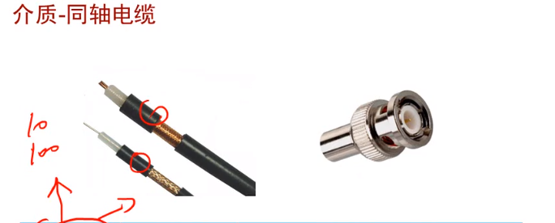
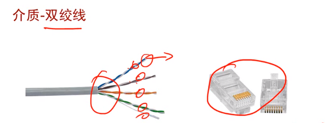
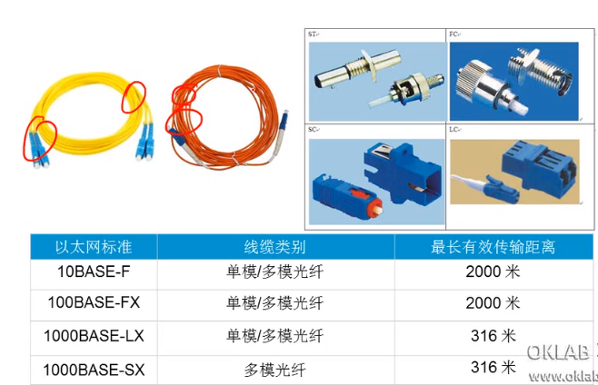
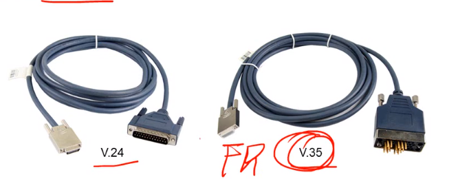
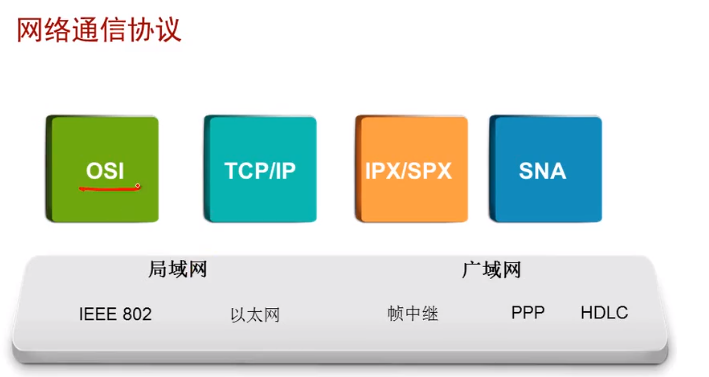
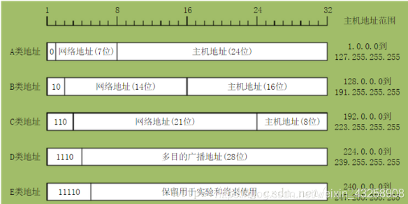

### 传输介质

* 同轴电缆------家用的有限电视

  

* 双绞线-------正常使用的网线

  

* 光纤---------家用上网，光猫一端接光纤，一端接网线

  

* 串口电缆

  

## 网络通信协议

### IP地址分类

* A类地址：1～126。注意，数字0和 127不作为A类地址，数字127保留给内部回送函数，而数字0则表示该地址是本地宿主机，不能传送。

  范围：1.0.0.1到126.255.255.254

  

* B类地址：第一组数字为128～191。

  范围：128.0.0.1到191.255.255.254

  

* C类地址:  第一组数字为192～223。

  范围：192.0.0.1到223.255.255.254

  

### VLSM/CIDR：变长掩码和无类域间路由

* 从上面的IP地址分类可以看出，不同类别的地址掩码从24、16、8，导致地址分配不够灵活

* 无类别域间路由是基于**可变长子网掩码（VLSM）**来进行任意长度的前缀的分配的。在RFC 950（1985）中有关于可变长子网掩码的说明。CIDR包括：

  - 指定任意长度的前缀的可变长子网掩码技术。遵从CIDR规则的地址有一个后缀说明前缀的位数，例如：192.168.0.0/16。这使得对日益缺乏的IPv4地址的使用更加有效。

    

  - 将多个连续的前缀聚合成**[超网](https://zh.wikipedia.org/w/index.php?title=超网&action=edit&redlink=1)**，以及，在互联网中，只要有可能，就显示为一个聚合的网络，因此在总体上可以减少路由表的表项数目。聚合使得互联网的路由表不用分为多级，并通过VLSM逆转“划分子网”的过程

